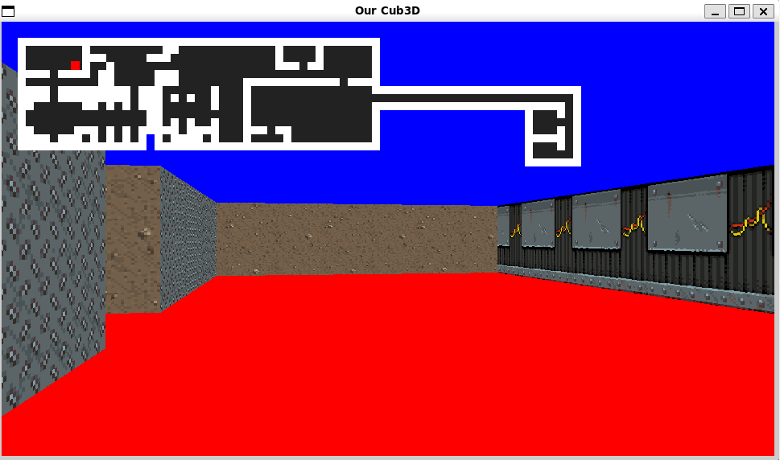
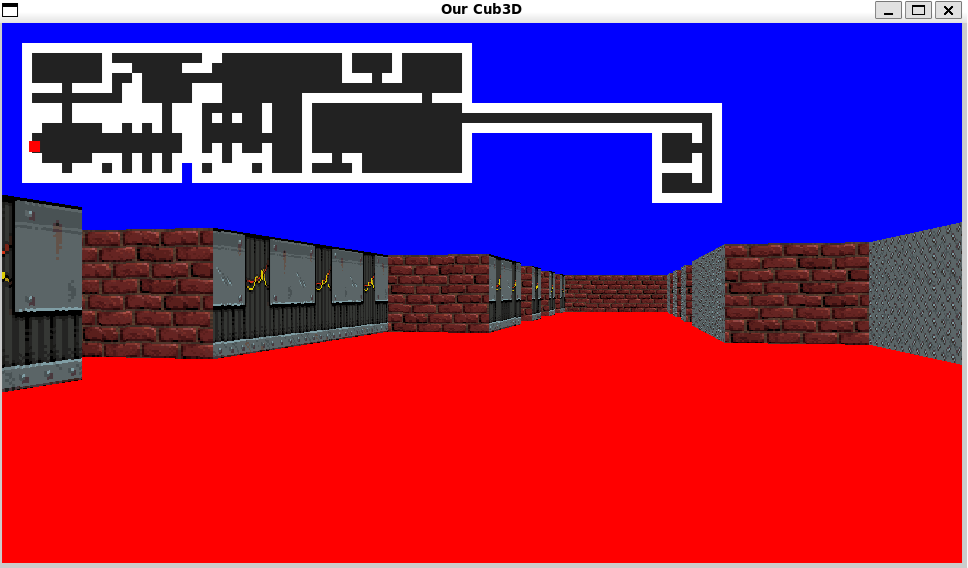
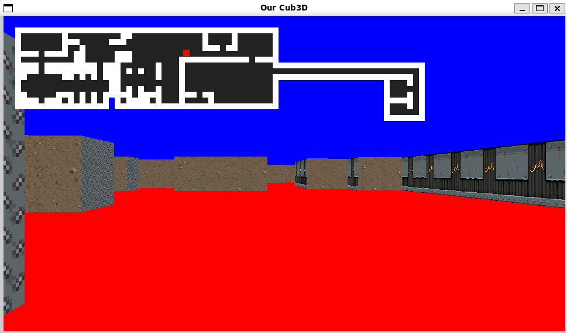

# Cub3D

A simple 3D raycasting engine written in C using MiniLibX, developed as part of the 42 Lisboa Common Core curriculum.

Developed collaboratively by **Fábio Santos** and **Tomaz Lima**.

The objective of this project is to implement a raycasting engine inspired by the rendering techniques used in early first-person games such as *Wolfenstein 3D*.

---

## Screenshots

<p align="center">
    
</p>

<p align="center">
    
</p>

<p align="center">
    
</p>

---

## Features

* Raycasting engine
* First-person camera
* Texture mapping
* Wall collision detection
* Player movement
* Camera rotation
* Custom map parsing
* Configurable wall textures
* Floor and ceiling colors
* Minimap

---

## Technologies

* C
* MiniLibX
* X11
* Linux
* Makefile

---

## Requirements

The project was developed and tested on Linux.

Install the required packages:

```bash
sudo apt update

sudo apt install build-essential \
libx11-dev \
libxext-dev \
libbsd-dev \
xorg \
x11-apps
```

MiniLibX is already included in this repository, so no additional installation is required.

---

## Build

Compile the project:

```bash
make
```

Clean object files:

```bash
make clean
```

Remove object files and executable:

```bash
make fclean
```

Rebuild the project:

```bash
make re
```

---

## Usage

Run the project:

```bash
./cub3D example.cub
```

The repository includes two example maps:

* `example.cub`
* `example2.cub`

You may also create your own `.cub` files following the project configuration format.

---

## Controls

| Key | Action        |
| --- | ------------- |
| W   | Move Forward  |
| S   | Move Backward |
| A   | Move Left     |
| D   | Move Right    |
| ←   | Rotate Left   |
| →   | Rotate Right  |
| ESC | Exit          |

---

## Map Configuration

The engine reads configuration files with the `.cub` extension.

Each map must contain:

* North texture
* South texture
* West texture
* East texture
* Floor color
* Ceiling color
* Map layout
* Player starting position

Example:

```text
NO textures/example.xpm/png
SO textures/example.xpm/png
WE textures/example.xpm/png
EA textures/example.xpm/png

F 220,100,0
C 225,30,0

111111111
100000001
10N000001
100000001
111111111
```

---

## Implementation

### Parsing

The parser validates:

* Texture paths
* RGB color values
* Player starting position
* Invalid characters
* Duplicate configuration entries
* Closed map validation

### Rendering

The rendering engine uses the classic raycasting algorithm.

For every frame:

1. Cast one ray for each screen column.
2. Detect the closest wall hit.
3. Calculate the perpendicular wall distance.
4. Select the correct wall texture.
5. Render the textured wall with perspective correction.
6. Draw the floor and ceiling.

### Texture Mapping

Textures are loaded from XPM files and sampled according to the ray intersection point, ensuring proper alignment and perspective.

### Minimap

The minimap displays:

* Player position
* Player orientation
* Current map layout

and updates continuously as the player moves.

---

## Concepts Covered

* Raycasting
* Computer Graphics
* Texture Mapping
* Collision Detection
* Event Handling
* File Parsing
* Memory Management
* Mathematical Algorithms

---

## What We Learned

Developing Cub3D provided us with a deeper understanding of computer graphics and low-level rendering techniques.

Throughout this project we learned how to:

* Implement a complete raycasting engine.
* Parse and validate complex configuration files.
* Design a robust map validation system.
* Perform texture mapping with perspective correction.
* Handle user input using MiniLibX.
* Optimize mathematical calculations for real-time rendering.
* Collaborate effectively on a medium-sized software project.
